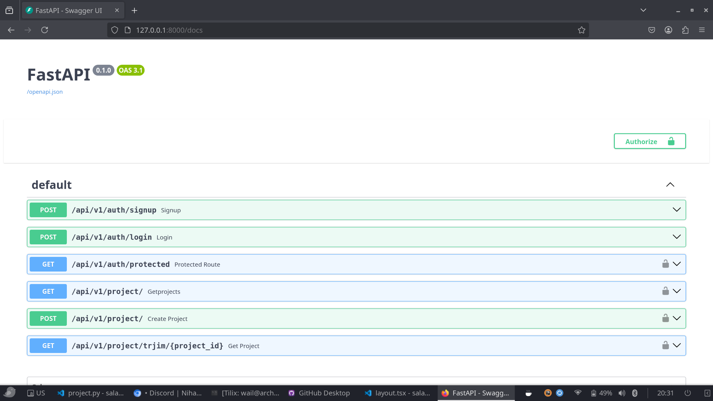

# tarjim Project

This is a FastAPI-based project that provides authentication and project management APIs for trjim needs
to automate i18n stuff  using github api and stripe for payement using fastapi 


## Installation & Setup


1. **Create a virtual environment**  
   ```sh
   python -m venv venv
   source venv/bin/activate  
   ```

2. **Install dependencies**  
   ```sh
   pip install -r requirements.txt
   ```

3. **Run the FastAPI server**  
   ```sh
   uvicorn main:app --reload
   ```

4. **Access API documentation**  
   Open your browser and go to:  
   - Swagger UI: [http://127.0.0.1:8000/docs](http://127.0.0.1:8000/docs)  
   - 
   - Redoc UI: [http://127.0.0.1:8000/redoc](http://127.0.0.1:8000/redoc)

---

## API Endpoints

### Authentication
- **POST** `/api/v1/auth/signup` – Register a new user  
- **POST** `/api/v1/auth/login` – Authenticate a user  
- **GET** `/api/v1/auth/protected` – Access a protected route (requires authentication)  

### Project Management
- **GET** `/api/v1/project/` – Get all projects  
- **POST** `/api/v1/project/` – Create a new project  
- **GET** `/api/v1/project/trjim/{project_id}` – Get a project by ID  

---

## Environment Variables
Create a `.env` file and configure required settings, such as database credentials, secret keys, etc.

---

